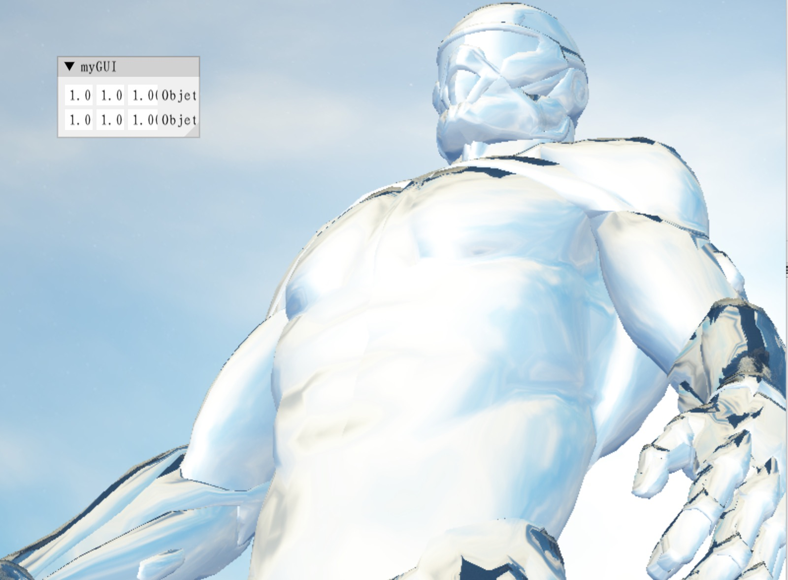
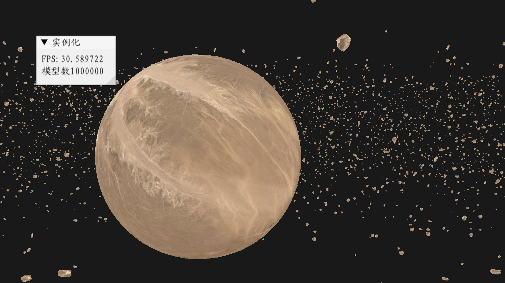

# OpenGL学习
克隆项目
```bash
git clone git@github.com:ImGili/learnopengl.git --recursive
```

## 编译项目
### macos及linux平台
```bash
cd build 
cmake ..
make
```
### Windows平台
```bash
cd build 
cmake ..
```

## 实验案例

### 实验2005
折射天空盒子


### 实验2305
加载100万个小行星模型
